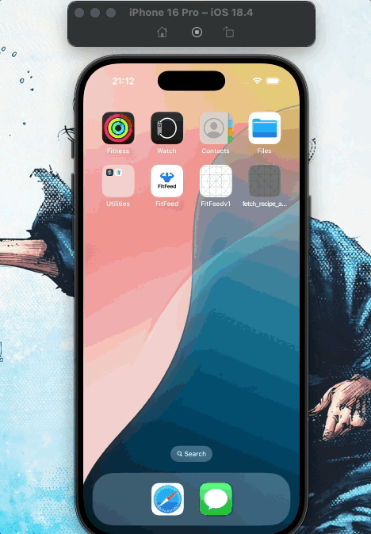

#  Fetch Recipe Take Home Test

## TODO
- [x] Fix splashscreen animation

- [x] Create viewModel for Recipe Card to accept data from API call

- [x] Create viewModel and View for When user clicks on Recipe Card to open FullRecipeCard (Slides up and shows larger picture + youtube video and extra details)
    - Build view and use RecipeCardViewModel for getting recipe names and such
- [x] RecipeList: Add refresh to recipe list

- [x] Create TabBar

- [x] Add filtering by cuisine to header

- [x] Account for network usage

- [x] Create tests

- [x] Complete questions and answers at the bottom of the README

---

## Goal: 
    - Build a recipe app that displays recipes from an API endpoint (https://d3jbb8n5wk0qxi.cloudfront.net/recipes.json)
    - Application should handle error from both empty data and Malformed data 
        - If a recipe is malformed, your app should disregard the entire list of recipes and handle the error gracefully. 
            - https://d3jbb8n5wk0qxi.cloudfront.net/recipes-malformed.json
        -  If the recipes list is empty, the app should display an empty state to inform users that no recipes are available.
            - https://d3jbb8n5wk0qxi.cloudfront.net/recipes-empty.json

---
## Features: 
    - Each recipe shows it's name, photo, and cuisine type
    - Sort recipes
    - User's should have the ability to refresh the list of recipes
---
## Requirements
    - Swift Concurrency: use async/await for operations including API calls and image loading
    - No external dependencies
    - Effiencent Network Usage:
        - Load images only when needed in the UI to avoid unnecessary bandwidth consumption
        -  Cache images to disk to minimize repeated network requests
        - Implement this fully yourself without relying on any third-party solutions, URLSession's HTTP default cache setup, or the URLCache implementation
    - Include Tests: 
        - Use your judgement to determine what should be tested and the appropriate level of coverage. Focus on testing the core logic of your app (e.g., data fetching and caching)
---
## JSON Structure:
```
Key                 Type    Required    Notes
cuisine            string    yes    The cuisine of the recipe.
name               string    yes    The name of the recipe.
photo_url_large    string    no    The URL of the recipes’s full-size photo.
photo_url_small    string    no    The URL of the recipes’s small photo. Useful for list view.
uuid               string    yes    The unique identifier for the receipe. Represented as a UUID.
source_url         string    no    The URL of the recipe's original website.
youtube_url        string    no    The URL of the recipe's YouTube video.
```

```
{
    "recipes": [
        {
            "cuisine": "British",
            "name": "Bakewell Tart",
            "photo_url_large": "https://some.url/large.jpg",
            "photo_url_small": "https://some.url/small.jpg",
            "uuid": "eed6005f-f8c8-451f-98d0-4088e2b40eb6",
            "source_url": "https://some.url/index.html",
            "youtube_url": "https://www.youtube.com/watch?v=some.id"
        },
        ...
    ]
}
```
---

## Answer and questions section:

**Summary:** Include screen shots or a video of your app highlighting its features


**Focus Areas:** What specific areas of the project did you prioritize? Why did you choose to focus on these areas?
<p>
    I focused on three main areas while building the app:

* **UI/UX:** I prioritized creating a clean, intuitive interface to elevate the user experience. Since this is a relatively simple app in terms of features, I wanted to ensure that users could easily navigate and visually engage with the content. Each recipe is clearly presented in its own card, and I added a filter button to allow users to quickly sort recipes by cuisine, making the experience more interactive and personalized.
   
* **Error Handling:** I put significant effort into error handling, both for debugging and for end-user clarity. I structured my alerts using a reusable AlertItem model to avoid repetitive code, and I made sure to distinguish between different error states (malformed JSON, empty results, or network failure) rather than using a generic error message. This made the app feel more reliable and transparent from the user’s perspective.

* **Image Caching:** This was my first time implementing manual disk-based image caching, and it was a key learning experience. In past projects, I relied on Firebase to handle image retrieval and storage, so managing caching myself gave me insight into how performance and bandwidth can be improved significantly. By caching images locally, the app avoids unnecessary downloads and loads content much faster when reopened, which directly improves the user experience.
    </p>

**Time Spent:** Approximately how long did you spend working on this project? How did you allocate your time?
  * In total I spent approximately 9 to 11 hours total.
    * 30 min to an hour: Planning UI/Structuring project
    * 2 hours in building frontend interface (I kept changing the intial direction I wanted to take)
    * 4 hours spent learning/implmenting API response, caching to disk/ and getting viewModels to work as intended
    * 2 hours spent learning how to implement tests
    * 1 hour spent answering these questions
  * Because of me creating the app around the time of my finals, it was difficult for me to dedicate individual sessions to work on the project, so I had to split my time throughout a week.
    
**Trade-offs and Decisions:** Did you make any significant trade-offs in your approach?
        <p>
        Yes, I made a few intentional trade-offs in order to focus on areas that would have the most impact for this project. One example was choosing not to implement extensive unit testing for the UI layer or view models, and instead focusing my tests on the core logic, such as the data fetching and image caching, as they were curcial parts of the requirements and application
        </p>
        <p>
        Another trade-off was prioritizing a clean and responsive interface over advanced functionality, like saving favorite recipes or offline support. Given the limited scope and timeline, I decided it was more important to deliver a polished, bug-free experience for the features that were already in place.
        </p>

**Weakest Part of the Project:** What do you think is the weakest part of your project?
<p>
    I think the weakest part of the project is the limited user functionality beyond browsing and filtering. The app doesn't currently allow users to interact with recipes beyond viewing them, for example, saving favorites, sharing links, or leaving notes. If I had more time, I would have explored adding lightweight user interactions or persistent state features to make the app feel more engaging and useful.
</p>

**Additional Information:** Is there anything else we should know? Feel free to share any insights or constraints you encountered
   <p>
        I'm still actively learning Swift, so this project gave me a chance to dive deeper into areas I hadn’t worked with before, like manual image caching, error handling architecture, and disk-based data management. Building something end-to-end helped reinforce what I’ve been learning and pushed me to write cleaner, more intentional code.
    </p>
    <p>
        Thanks again for the opportunity, this was a fun and challenging take-home that pushed me to think more deeply about efficiency and code quality.
    </p>

---
